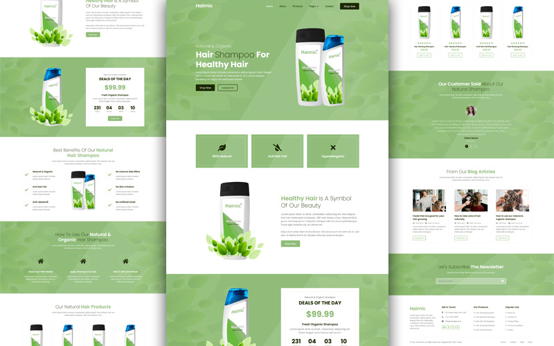

# ProductLanding-Hair
Product Landing-Hair a clean and well-commented codebase, the theme ensures better engagement on any single product website.

<div align="center">
  
  
  
  
[](https://twitter.com/intent/follow?screen_name=sadhin_halder)

  <br />
  <br />

  <h2 align="center">Product Landing-Hair Website</h2>

  Product Landing-Hair is a fully responsive Products Landing website, <br />Responsive for all devices, build using HTML, CSS, and JavaScript.

  <a href="https://sadhin555.github.io/Landing-Hair/"><strong>➥ Live Demo</strong></a>

</div>

<br />

### Demo Screeshots



### Prerequisites

Before you begin, ensure you have met the following requirements:

* [Git](https://git-scm.com/downloads "Download Git") must be installed on your operating system.

### Run Locally

To run **Glowing** locally, run this command on your git bash:

Linux and macOS:

```bash
sudo git clone https://github.com//sadhin555/ProductLanding-Hair.git
```

Windows:

```bash
git clone https://github.com//sadhin555/ProductLanding-Hair.git
```

### Contact

If you want to contact with me you can reach me at [Twitter](https://www.twitter.com/sadhin_halder).

### MT License

This project is **MT** license.
